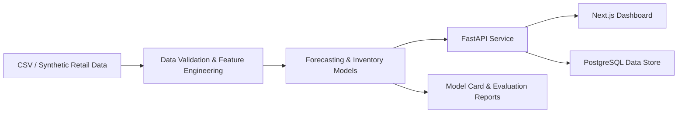

# Architecture

## Components
- `src/demand_intelligence` contains the data generation, feature engineering, forecasting, and inventory logic.
- `backend/app` holds the API service and schemas.
- `frontend` renders the business dashboard in real time.
- `data/sample` stores the generated retail dataset used for the proof of concept.
