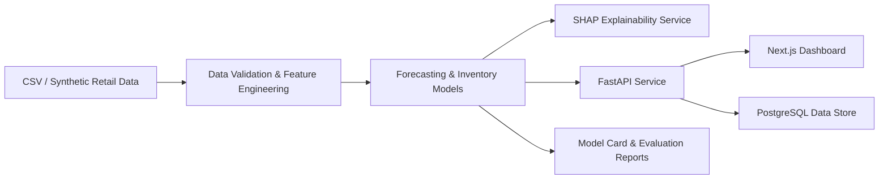

# Architecture

## Forecast Accuracy Analytics Flow

```text
Historical Actual Demand -> Production Forecast -> Forecast Error
       -> Accuracy Metrics / Bias -> Product, Store, Category, Region, Time
       -> Operational Inventory Indicators -> FastAPI -> Next.js Dashboard
```

The analytics endpoint performs one backend computation with the persisted production model and returns reusable structured results.



## Components
- `src/demand_intelligence` contains the data generation, feature engineering, forecasting, and inventory logic.
- `src/demand_intelligence/inventory_intelligence.py` provides ABC/XYZ classification, ABC-XYZ matrixing, health scoring, opportunity detection, and service-level analytics.
- `src/demand_intelligence/explainability.py` provides local SHAP explanations for supported tree model artifacts.
- `backend/app` holds the API service and schemas.
- `frontend` renders the business dashboard in real time, including the inventory intelligence section.
- `data/sample` stores the generated retail dataset used for the proof of concept.

## Database runtime
PostgreSQL is the recommended runtime database for Docker and deployment. SQLite remains available only when the environment explicitly sets `DATABASE_MODE=sqlite` for local development. The service does not silently default to SQLite when PostgreSQL configuration is expected but missing or incomplete.
The dashboard also calls `POST /api/v1/simulate`. The simulation service loads
the persisted production model, constructs the production feature contract,
performs recursive inference, reuses inventory optimization, and returns
baseline/scenario impact plus SHAP drivers. It does not train models during
requests or track open purchase orders.

Model monitoring follows the same service boundary: deterministic historical
reference data and the current monitoring window flow through quality checks,
PSI drift calculations, production-model predictions, and existing evaluation
metrics before the consolidated `GET /api/v1/monitoring` response reaches the
dashboard.

Model lifecycle uses a lightweight file registry rather than a new external
orchestration dependency:

```text
Training data -> feature pipeline -> challenger -> evaluation
    -> champion/challenger rules -> registry -> production model -> monitoring
```

Promotion is explicit and recoverable; rejected challengers never replace the
champion, and rollback accepts only registry-managed compatible artifacts.
